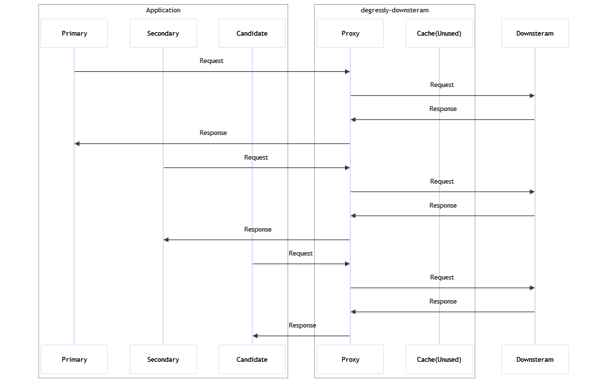
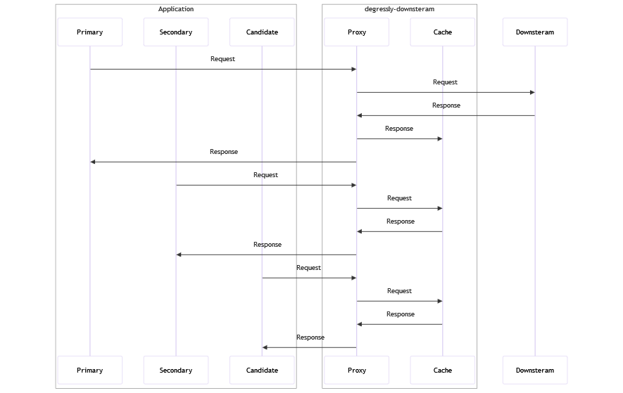

# degressly-downstream
Downstream proxy for Degressly.

[](https://www.buymeacoffee.com/daniyaalk)

---

degressly-downstream tracks downstream requests made by an application under regression testing.
It takes observations of API calls performed by each node(primary, secondary and candidate) and can send data to degressly-comparator for further analysis.

## Quick start

Run degressly-core with:
```mvn spring-boot:run```

### Config flags (VM options)

| Flag                               | Example             | Description                                                                                               |
|------------------------------------|---------------------|-----------------------------------------------------------------------------------------------------------|
| diff.publisher.bootstrap-servers   | localhost:9092      | Address of kafka bootstrap servers for integration with degressly-comparator                              |
| diff.publisher.topic-name          | diff_stream         | Kafka topic name for integration with degressly-comparator                                                |
| non-idempotent.proxy.enabled       | false(default)/true | Proxy requests in non-idempotent downstream mode when set to true                                         |
| non-idempotent.wait.timeout        | 1000000(default)    | Time in ms to wait when a request arrives from secondary or candidate before primary                      |
| non-idempotent.wait.retry-interval | 100(default)        | Interval for performing cache lookups when waiting for response of primary request in non-idempotent mode |


## Modes:
* Idempotent downstream mode:
  * Calls from each instance are proxied to the downstream service and their respective responses returned.
  
* Non-idempotent downstream mode:
  * To be used when downstream services must be called once and only once.
  * Downstream response from the primary request is stored in cache, and the same is returned for secondary and candidate API calls for the same URL and trace id.
  


## Limitations

* Since degressly-downstream works as an HTTP Proxy, HTTPS S2S calls are not supported. 
  * This can be worked around by using an LB that performs SSL termination with a trusted self-signed certificate - left as an exercise for the reader 😉
* New API Integrations cannot be tested when operating in non-idempotent since cache will never be loaded.
* `trace-id` headers are a hard requirement from each client
